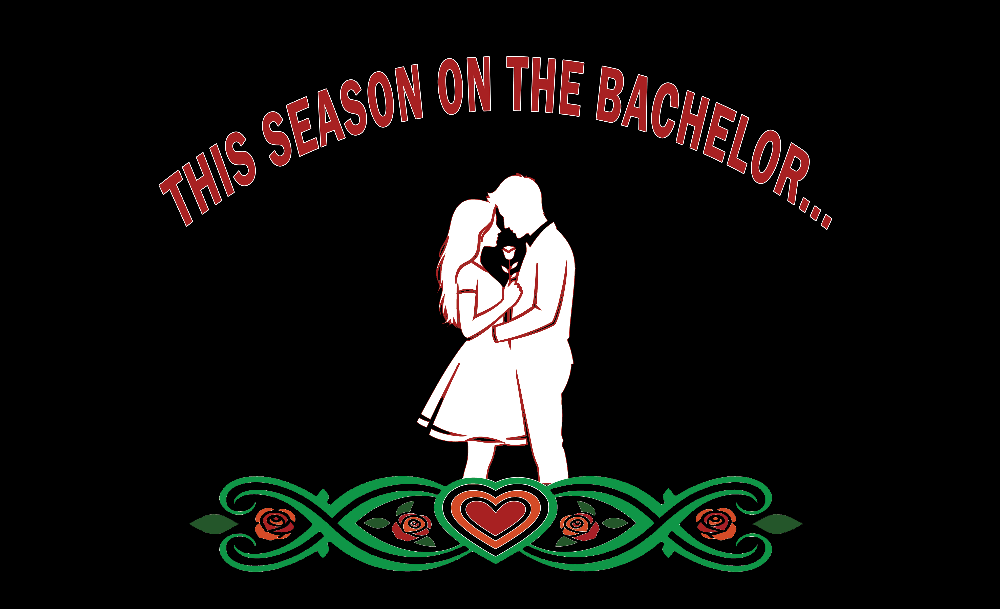
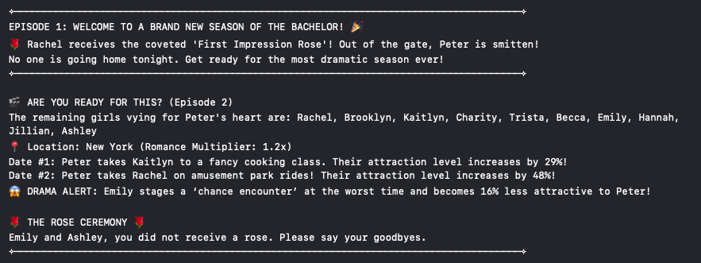

  
   
  

# 🌹 The Bachelor: Logic & State Simulation (Swift)

A dynamic command-line simulation built in Swift that manages contestant data, affection levels, and randomized episode events. This project was designed to demonstrate core programming concepts through a fun, pop-culture lens.

## 🚀 Key Features
*   **State Management:** Tracks 10+ contestants across multiple "episodes" using Dictionaries and Arrays.
*   **Weighted Randomization:** Uses location and activity multipliers to dynamically calculate attraction scores.
*   **Mutating Logic:** Implements specialized Struct methods to handle mid-season contestant swaps (The "Ex-Girlfriend" Twist).
*   **Clean Code:** Adheres to `camelCase` naming conventions and descriptive variable naming for long-term readability.

## 🛠️ Technical Skills Demonstrated
*   **Swift Collections:** Array manipulation (sorting, shuffling, prefixing) and Dictionaries.
*   **Control Flow:** `while` loops for simulation engines and `if-else` for event triggers.
*   **String Interpolation:** Custom narrative generation using multiline string literals.
